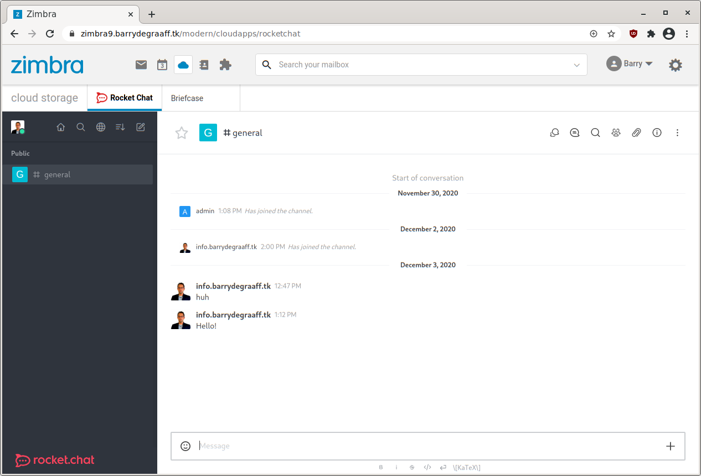
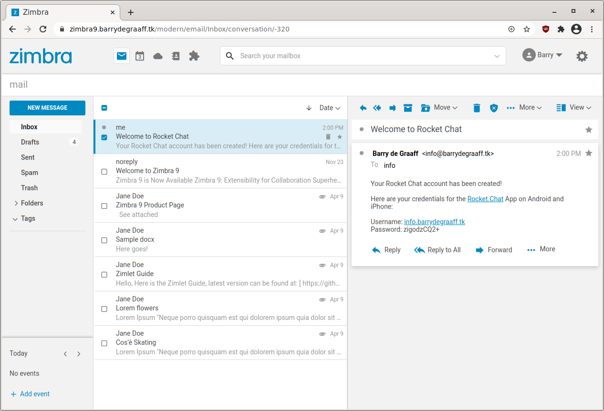

# Rocket Chat integration for Zimbra 9

This Zimlet will automatically create accounts for your users and will log them on to Rocket Chat automatically. The Zimlet will create accounts in Rocket Chat based on the Zimbra primary email address. So user@example.com in Zimbra becomes user.example.com in Rocket Chat. Once set-up the users can only log-in via the Zimbra log-in page this includes mobile device apps. A welcome email is send to the user with a fallback password, this can only be used in situations where the integration is disabled.

## How to install Rocket Chat

On this github we will not cover the installation of Rocket Chat, as it's perfectly explained here:
* https://rocket.chat/docs/installation/minimum-requirements
* https://www.digitalocean.com/community/tutorials/how-to-install-configure-and-deploy-rocket-chat-on-ubuntu-14-04
* https://www.howtoforge.com/tutorial/how-to-install-rocket-chat-with-nginx-on-ubuntu-16-04/

## Check permissions in Rocket Chat IMPORTANT!
As of Rocket Chat version 2.1.0 you must set the CREATE_TOKENS_FOR_USERS environment variable for this integration to work. If you use snaps:

    echo "CREATE_TOKENS_FOR_USERS=true" > /var/snap/rocketchat-server/common/create-tokens.env
    sudo systemctl restart snap.rocketchat-server.rocketchat-server.service
        
Rocket Chat is designed to be deployed on Docker or Ubuntu Snap, which is really great:
* https://rocket.chat/docs/installation/docker-containers/
* https://rocket.chat/docs/installation/manual-installation/ubuntu/snaps/

## Setting up Zimbra
For this you need to set-up the Java server extension copy it from https://github.com/Zimbra-Community/zimbra-rocket/releases to /opt/zimbra/lib/ext/rocket/rocket.jar ( and make sure this is the only jar in this folder) then create a text file /opt/zimbra/lib/ext/rocket/config.properties with the contents:

        adminuser=adminUsername
        adminpassword=adminPassword
        rocketurl=https://rocket.example.org
        loginurl=https://mail.example.org

This adminuser and password you should have created when you first installed Rocket. The loginurl is the place where we point users to that have not yet authenticated. This can be your SSO login page or the Zimbra login page. Don't forget `zmmailboxdctl restart`.

You must also configure Rocket chat like so:

Be careful, as you can easily lock yourself out if something does not work. If you want more details check: https://github.com/Zimbra-Community/zimbra-rocket/wiki/Debugging

Also enable the full iframe integration like so:

You must also configure and deploy the Zimlet:
      
Get zimbra-zimlet-rocketchat.zip for Zimbra 9 (from Github releases) and as Zimbra user:

      zmzimletctl deploy zimbra-zimlet-rocketchat.zip
      
To configure the rocketurl in the Zimlet

       zmzimletctl getConfigTemplate zimbra-zimlet-rocketchat.zip > /tmp/myconfig.xml
      
Edit /tmp/myconfig.xml and set `rocketurl`. Example: https://rocketchat.example.com/. Import the new configuration file by the running following command:

      zmzimletctl configure /tmp/myconfig.xml
