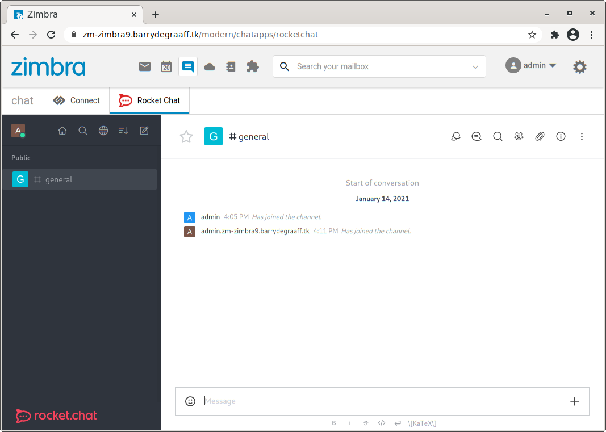

# Rocket Chat integration for Zimbra 9

This Zimlet will automatically create accounts for your users and will log them on to Rocket Chat automatically. The Zimlet will create accounts in Rocket Chat based on the Zimbra primary email address. So user@example.com in Zimbra becomes user.example.com in Rocket Chat. Once set-up the users can only log-in via the Zimbra log-in page this includes mobile device apps. A welcome email is send to the user with a fallback password, this can only be used in situations where the integration is disabled.

## How to install Rocket Chat

Follow the instruction for setting up Rocket Chat using Snap on Ubuntu 18. 

- https://docs.rocket.chat/installation/snaps

## Allow API tokens to be used

    echo "CREATE_TOKENS_FOR_USERS=true" > /var/snap/rocketchat-server/common/create-tokens.env
    sudo systemctl restart snap.rocketchat-server.rocketchat-server.service

## Set up a reverse proxy

This will allow you to use TLS/SSL and configure headers needed for the integration. See the proxy-config folder for a basic example nginx/apache config.

      apt install nginx
      systemctl enable nginx   

Modify the config in `/etc/nginx/sites-enabled/default` as per the example in proxy-config folder.

      systemctl start nginx

## Setting up Zimbra
For this you need to set-up the Java server extension copy it from https://github.com/Zimbra-Community/zimbra-rocket/releases to /opt/zimbra/lib/ext/rocket/rocket.jar ( and make sure this is the only jar in this folder) then create a text file /opt/zimbra/lib/ext/rocket/config.properties with the contents:

        adminuser=adminUsername
        adminpassword=adminPassword
        rocketurl=https://rocket.example.org
        loginurl=https://mail.example.org

This adminuser and password you should have created when you first installed Rocket. The loginurl is the place where we point users to that have not yet authenticated. This can be your SSO login page or the Zimbra login page. Don't forget `zmmailboxdctl restart`. Do not put a / at the end of rocketurl! Make sure to configure X-Frame-Options/Access-Control-Allow-Origin on the Rocket Chat server side. You must remove this headers in a reverse proxy and add the correct ones for the integration to work. See the proxy-config for a basic example nginx/apache config.

You must also configure Rocket chat like so:

Be careful, as you can easily lock yourself out if something does not work. If you want more details check: https://github.com/Zimbra-Community/zimbra-rocket/wiki/Debugging

Also enable the full iframe integration like so:

# Configure and deploy the Zimlet:
      
Get zimbra-zimlet-rocketchat.zip for Zimbra 9 (from Github releases) and as Zimbra user:

      zmzimletctl deploy zimbra-zimlet-rocketchat.zip
      
To configure the rocketurl in the Zimlet add your url and create a config template:

      echo '<zimletConfig name="zimbra-zimlet-rocketchat" version="0.0.1">
          <global>
              <property name="rocketurl">https://rocketchat.barrydegraaff.tk/</property>
          </global>
      </zimletConfig>' > /tmp/rocket_config_template.xml
           
Import the new configuration file by the running following command:

      zmzimletctl configure /tmp/rocket_config_template.xml
